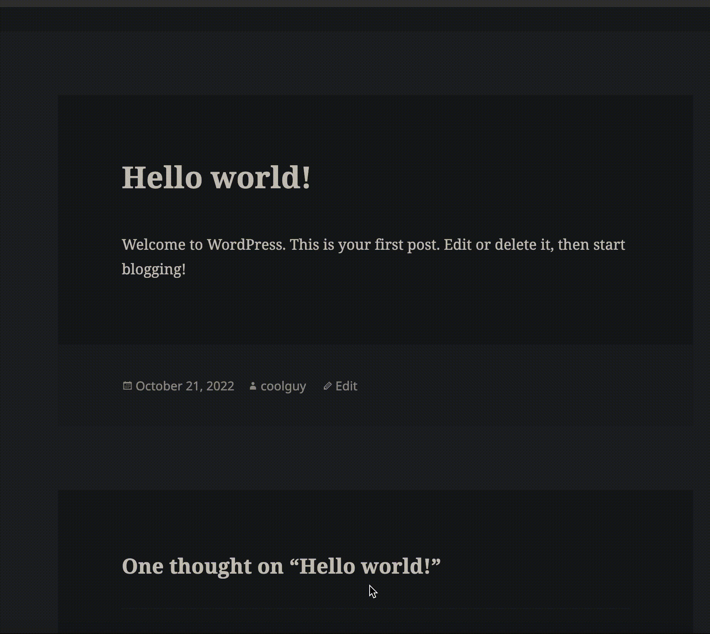
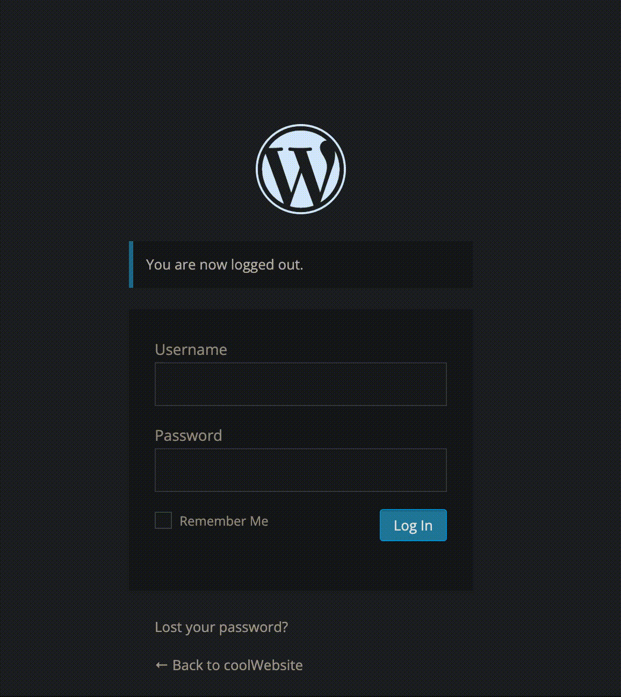
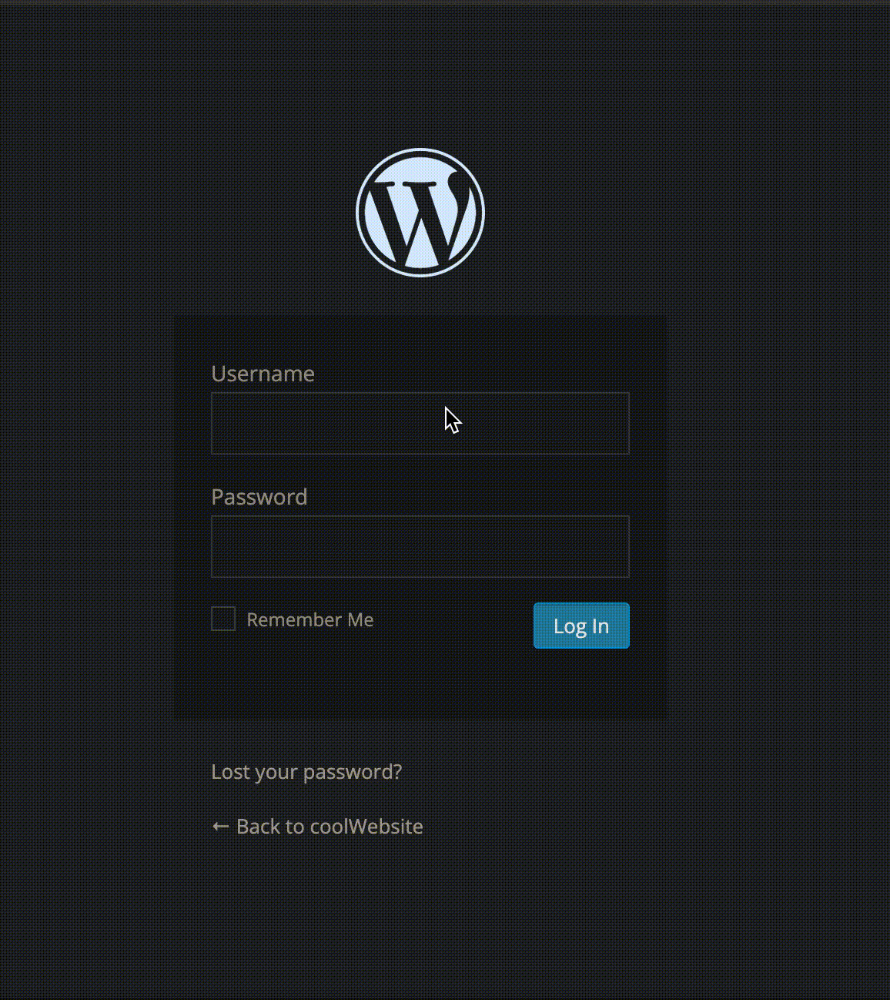

# Project 7 - WordPress Pen Testing

Time spent: **6** hours spent in total

> Objective: Find, analyze, recreate, and document **three vulnerabilities** affecting an old version of WordPress

## Pen Testing Report

### 1. (Required) Cross-site Scripting (CVE-2015-3438)

- [ ] Summary: A post was created. In the comment section of the post, a new comment was created, with the comment being an exploitable script. The browser then displayed an alert after posting.
  - Tested in version: 4.1
  - Fixed in version: 4.1.2
- [ ] GIF Walkthrough:

- [ ] Steps to recreate: Create a post, then make a comment on that post with an exploitable script. Then try exploitable scrpits until one works. The oe used in this example was "<svg onload=alert(1)>".

- [ ] Affected source code:
  - [Link 1](https://core.trac.wordpress.org/browser/tags/4.1/src/wp-admin/includes/class-wp-screen.php)
  
### 2. (Required) User Enumeration (CWE-203)

- [ ] Summary: Accounts were created. Users were then able to be identified based off an error message revealing whenter a username was valid or not.
  - Tested in version: 4.1
- [ ] GIF Walkthrough:

- [ ] Steps to recreate: Start by creating an account, then typing usernames. Make guesses for possible usernames until one gives an error for incorrect password.
- [ ] Affected source code:
  - [Link 1](127.0.0.1:8080/wp-login.php)

### 3. (Required) Password Enumeration (CWE-203)

- [ ] Summary: User enumeration was used to collect the usernames of registered accounts. A username was then cmopared to a list of common passwords, until one of them created a successful login.
  - Tested in version: 4.1
- [ ] GIF Walkthrough:

- [ ] Steps to recreate: Start by creating an account, then typing usernames. Make guesses for possible usernames until one gives an error for incorrect password. Then try common passwords until a successful login occurs.
- [ ] Affected source code:
  - [Link 1](127.0.0.1:8080/wp-login.php)

## Assets

Command for user enumeration:
>wpscan --url [URL] --api-token [API TOKEN] -e u

Command for enumerating through users and passwords:
>wpscan --url [URL] --api-token [API TOKEN] --usernames username.txt --passwords password.txt
- username.txt contains usernames obtained from previous command.
- password.txt contains many common passwords. 

## Resources

- [WordPress Source Browser](https://core.trac.wordpress.org/browser/)
- [WordPress Developer Reference](https://developer.wordpress.org/reference/)

GIFs created with https://cloudconvert.com/

## Notes

Finding the right exploits to do was a challenge. Using Docker was a first for me, so I needed to learn how to use it. I tried a few exploits not mentioned here, but could not execute them successfully. I need to practice more pen testing.

## License

    Copyright [2022] [rnhkz]

    Licensed under the Apache License, Version 2.0 (the "License");
    you may not use this file except in compliance with the License.
    You may obtain a copy of the License at

        http://www.apache.org/licenses/LICENSE-2.0

    Unless required by applicable law or agreed to in writing, software
    distributed under the License is distributed on an "AS IS" BASIS,
    WITHOUT WARRANTIES OR CONDITIONS OF ANY KIND, either express or implied.
    See the License for the specific language governing permissions and
    limitations under the License.