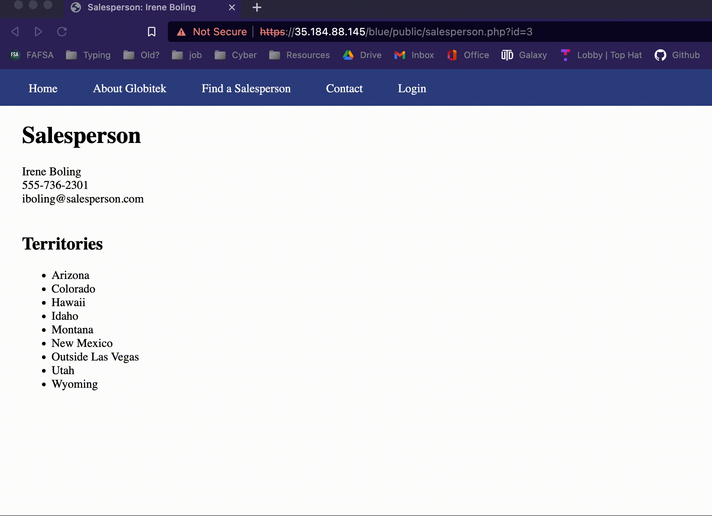
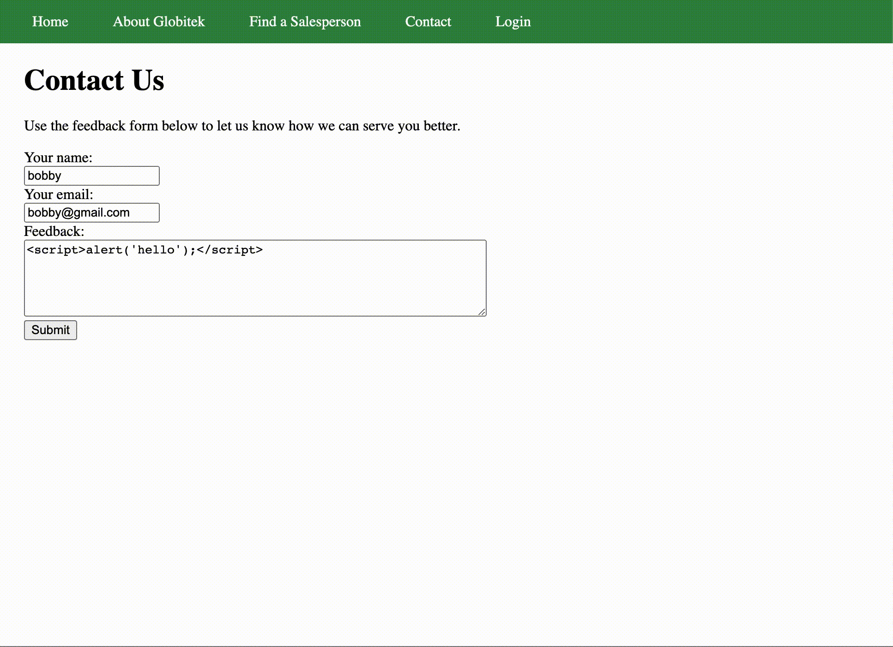
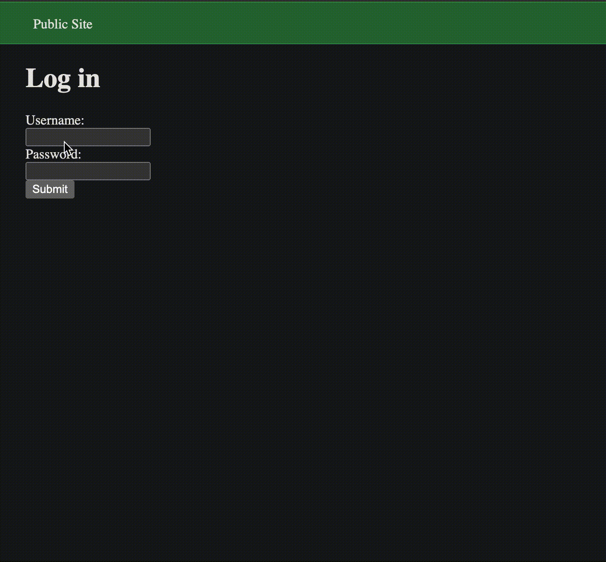

# Project 9 - Pentesting Live Targets

Time spent: **X** hours spent in total

> Objective: Identify vulnerabilities in three different versions of the Globitek website: blue, green, and red.

The six possible exploits are:

* Username Enumeration
* Insecure Direct Object Reference (IDOR)
* SQL Injection (SQLi)
* Cross-Site Scripting (XSS)
* Cross-Site Request Forgery (CSRF)
* Session Hijacking/Fixation

Each color is vulnerable to only 2 of the 6 possible exploits. First discover which color has the specific vulnerability, then write a short description of how to exploit it, and finally demonstrate it using screenshots compiled into a GIF.

## Blue

Vulnerability #1: SQL Injection

Description: In the "Find a Salesperson" section of the website, SQL injection can be performed using the url after clicking on any salesperson.

Vulnerability #2: Session Hijacking

Description: A staff member logs in. They click in a link, which is able to obtain their PHP session id using interception. This id can be used by an attacker to gain admin privilege without logging into an account.

## Green

Vulnerability #1: Cross Site Scripting

Description: In the "Contact Us" section of the website, javascript can be entered into the feedback. When an administrator views this feedback, the javascript is executed.

Vulnerability #2: User Enumeration

Description: In the "Login" section of the website, an error message is displayed if the incorrect username or password is entered. If a correct username is entered, this message is bold. Valid usernames can be found depending on if the error message is bold or not.

## Red

Vulnerability #1: Insecure Direct Object Reference

Description:

Vulnerability #2: Cross-site Request Forgery

Description:

## Notes

Finding vulnerabilities on the red site was difficult.

